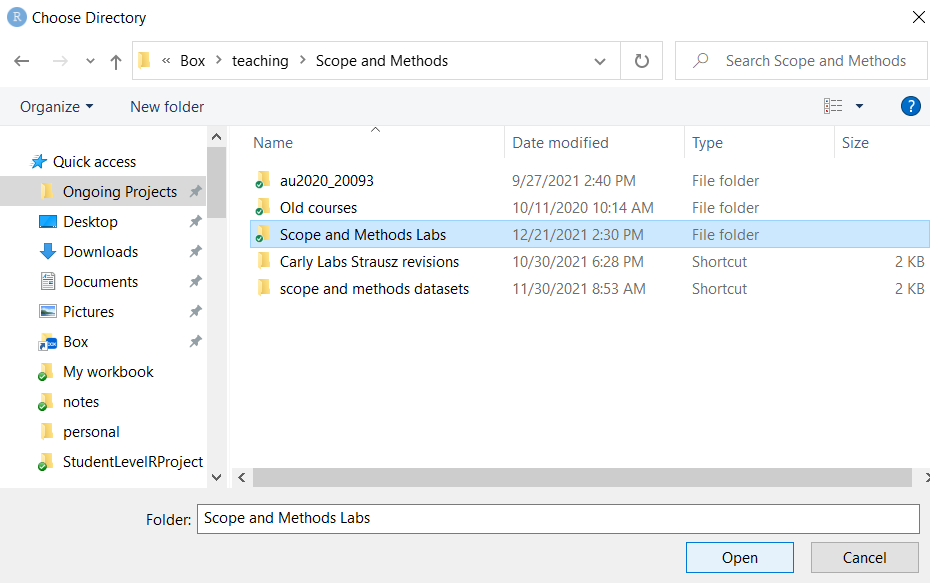
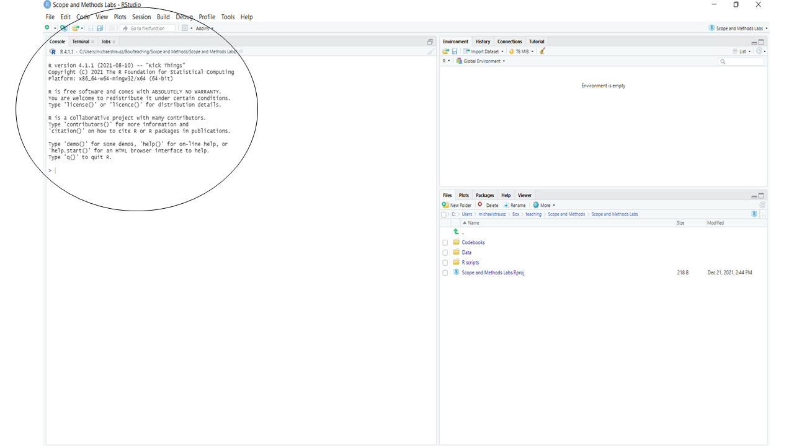
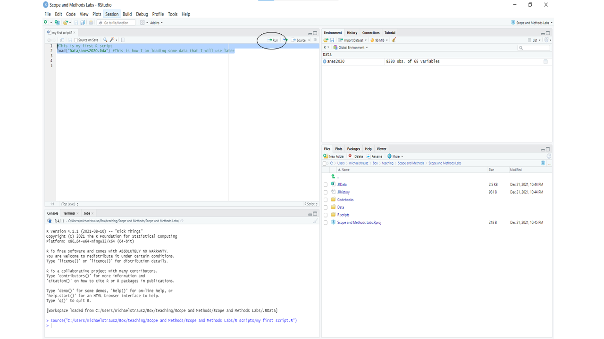
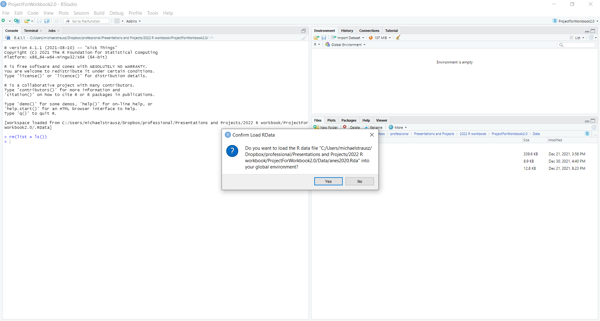

# Getting started with R {#getting-started}

## Why R? {#why-r}
R is a powerful, customizable, open source piece of software that is extremely useful for political science analysis (among many, many other uses). R has a steep learning curve (in other words, it is hard, especially at first), but your instructor is here to help you, and we will all be learning this together. Here are some of the biggest advantages of R:

1. R is free! In the past, I have taught this class with SPSS. As of this writing, the professional version of SPSS costs $99 per month for a subscription. 
2. Because R is open source, users are regularly writing custom programs to improve it, which they tend to share for free.
3. Because R is open source, there are great resources available for free online (see section \@ref(resources) for some of my favorites).
4. R is more powerful than SPSS. It can conduct statistical analyses and generate graphics that SPSS is not capable of (including maps with GIS data).
5. R is professional-grade software, extremely commonly used by professional analysts.
6. Familiarity with R will look great on your resume. It will show potential employers that you have some serious data skills and are capable of learning to code.
7. Learning R will help you learn to code in other pieces of software as well, which will be an important skill in the future.

In this course, I have **no expectation** that you have any background in coding or in statistical analysis. So, if you have no such experience, please do not worry! *You are not alone*. I would be surprised if more than a few of you have coding experience, and I will teach the class as if none of you do. If some parts of the class are review for you, that won’t hurt you either!

## Create a project for this class {#class-project}
Follow the following instructions to get your computer set up for this class.

1. First, you will have to download and install two pieces of software on your computer. NOTE: You can install these programs on a Mac or a PC, but not on an iPad or a tablet that is not running Windows or the Mac OS. 
  - You can find the first piece of software, R, here: [https://www.r-project.org/](https://www.r-project.org/){target="_blank"}. Download the most recent version of R for your system (the one with the highest number) that is not listed as a test or beta test version.  
  - You can find the second piece of software, RStudio, here: https://www.rstudio.com/products/rstudio/. Be sure to download RStudio Desktop open source edition.
2. Create a folder somewhere on your computer that you can easily find. If no place comes to mind use the Desktop. Title the folder "Scope and Methods Labs" (or another title that you would prefer). 
3. Open RStudio on your computer. 
4. Click on the "File" menu at the top, and then select "New Project."

```{r file_newproject, echo = FALSE, out.width='80%', out.height='50%'}
knitr::include_graphics("images/gettingstarted_1_file_newproject.png")
```

5. Select "Existing Directory" on the menu that comes up.

```{r existing_dir, echo = FALSE, out.width='60%'}
knitr::include_graphics("images/gettingstarted_2_existing_dir.png")
```

6. Navigate to the main folder that you just created (which I asked you to call "Scope and Methods Labs"), and click 
"Open."

```{r open, echo = FALSE, out.width='80%'}

```

6. Select "Create Project."

```{r create, echo = FALSE, out.width='60%'}
knitr::include_graphics("images/gettingstarted_4_create.png")
```

## Add the course files to your project {#add-files}
7. Go to this website: [https://github.com/strauszm/AreYouReady/tree/main/SupplementalWorkbookFiles](https://github.com/strauszm/AreYouReady/tree/main/SupplementalWorkbookFiles). Click on the words "Supplemental Workbook Files.zip." That will take you to a new screen where there is a link to the right with a little picture of an arrow pointing into a tray, like this:
```{r download, echo = FALSE, out.width='40%'}
knitr::include_graphics("images/gettingstarted_4_5_download.png")
```

Click that link to download the file. On your computer, unzip the file, and you should see three folders inside: "codebooks", "Data", and "rscripts". Copy the three folders and their contents to the project folder that you made before called "Scope and Methods Labs" (in section \@ref(class-project)).

Congratulations! You have set up R for this workbook (and for other uses too!)

## Using the Console
In order to use R we must use commands to tell R what to do. One way you can write commands is in the Console, here:

```{r console1, echo = FALSE, out.width='90%'}

```

At its most basic, you might think of R as a very, very fancy calculator. So, for example, I can type 45*21 in the Console (after the ">") and hit enter, and I have done my first R operation:

```{r firstop1, echo = FALSE, out.width='90%'}
knitr::include_graphics("images/gettingstarted_7_firstop.png")
```

What if we want to R remember that value? Then we can use this notation "<-" to assign that value to an object. You will soon see that programming in R often involves creating objects, modifying objects, and analyzing objects. There are a few rules about object names.

### Rules about naming objects

1. Object names cannot begin with a number.
2. Object names cannot have a space in them.
3.	R notices whether object names use capital or lower-case letters, so be careful with this. To avoid errors, copy and paste object names rather than typing them out.

### Common practices when naming objects

Common practices in naming objects are to use a "." between words, a "_" between words, or to capitalize each word after the first. So either: an.object, an_object, or anObject. You can choose which style you prefer. Let’s make our first object, using this command (you can copy and paste this command into your Console):
```
my.first.object<-45*21
```
When you copy and paste that code into your Console, you should see something like this:
```{r firstobject, echo = FALSE, out.width='90%'}

```

Notice what happened when we created this object. R did not give us the answer to our math problem in the Console, but instead put the object that we created in the Environment pane. This kind of object, a single value, is called a scalar. You won’t deal with these very frequently in this class.

### About vectors
A more commonly used kind of object is a vector – a list of two or more values. What if I want to create a vector that includes the my.first.object scalar and another number? One way that I can build a vector is with the c() function. The c here stands for concatenate, which means "bring together." Here is how I would use c() to build such a vector:

```
my.second.object<-c(my.first.object, 2)
```
If you enter that into the Console, you will see in the Environment pane there are now two objects in your Environment: my.first object (a scalar with a value of 945) and my.second.object (a vector with two values: 945 and 2). But you actually don’t need to remember these objects, right? No need to have it gunking up your Environment. So you can use the rm() command to remove them (rm() means remove). Just type this into the Console, and you will see the first object, the scalar, disappear from the Environment:
```
rm(my.first.object)
```
Then type this into the Console and you will see the second object, the vector, disappear:
```
rm(my.second.object)
```
## Writing your first R script
You will often want to write a series of commands in R that you will be able to refer back to and modify. In that case, instead of writing them in the Console, you can write them in a script file. 

Let’s write our first R script! Go to the File menu at the top of your screen, select "New File" and then select R Script. Before starting to write it, save it in the R scripts section of the folders that you made (click "File" then "Save As" and then give it a name, like "my first script").

One thing to know about R is that R ignores hashtags (like "#"). Once R reads a hashtag, it stops reading the rest of that line. So, we can use # to insert our comments to remind us what we are doing with specific chunks of code.

Try entering something like this at the top of your page:
```
#This is my first R script
```
Now we are going to enter a command. We are going to use the load() command to load one of the datasets that we will be using in this class. Now type:

```
load("Data/anes2020.Rda") #This is how I am loading some data that I will use later.
```

**Be sure to include the "" around the name and location of the dataset.** The comment is not necessary, but it is there for your reference. So, at this point you should have two lines of script. To run this script, you must first select it, by highlighting it with your cursor.  Then, you can either click the little run button circled below or you can hit Cntl-Enter in a PC or Command-Enter on a Mac.

```{r run, echo = FALSE, out.width='90%'}

```

Once you run this script, you should see a new object in your environment: anes2020 (if that didn't work for you, see section \@ref(wont-load). This is a dataframe – a collection of vectors that are combined to give us a lot of interesting information. In this case, this dataframe tells us about a survey of residents of the United States from 2020. We will look more at this in future weeks. Save your R script, and be sure that you save changes to this project.

## What do to if the "load" command doesn't load the dataframe {#wont-load}
1. Click on the folder called "Data" in the bottom right of your screen.

```{r datafile, echo = FALSE, out.width='90%'}

```

2. That should open up a folder with the three dataframes that you downloaded earlier. Click on anes2020. You will get a warning message like this: 

```{r warning, echo = FALSE, out.width='90%'}

```

Click "Yes," and anes2020 should appear in your environment.

## Review of this chapter's commands 
```{r, echo=FALSE}
r1<-c("<-","To create an object. For example: \"this.object<-1\" assigns the number 1 to an object called \"this.object.\"")
r2<-c("c()","Concatenate. To combine more than one data point into a vector.")
r3<-c("rm()","Remove an object from your environment.")
r4<-c("#","Tells R to stop reading that line, so a useful prefix to comment and reminders.")
r5<-c("load()","Load an R-formatted dataframe.")
df<-rbind(r1,r2,r3,r4,r5)
colnames(df)<-c("Command","Purpose")
df<-as.data.frame(df)
rownames(df)<-NULL
knitr::kable(df, row.names=NA)
rm(r1,r2,r3,r4,r5,df)
```

## Review exercises

Let’s practice some of the things that we learned in this chapter. You can number each of your answers with comments (beginning with the # sign).

1. Create a new R script called "Chapter \@ref(getting-started) Exercises," and save it to the R scripts folder that you created earlier. Make the first line in the script a comment (using #) that includes your name and the phrase "Chapter 1 Exercises."
2. In 2023, TCU had 10,915 undergraduate students and 1,870 graduate students. Generate a scalar called "tcu.students" that is the total population of TCU students. **NOTE: leave the commas out of the numbers when entering them into R.**
3. In 2023 SMU had 7,115 undergraduate students and 4,727 graduate students. Generate a scalar called "smu.students" that is the total population of SMU students.
4. Use the c() command to generate a vector called dfw.area.students. This vector should have two values: the total number of students at TCU, and the total number of students at SMU.
5. Remove all three of these objects you created using three different rm() commands.
6. Use the load() command to load both states2010 (which you can find at "Data/states2010.Rda") and world (which you can find at "Data/world.Rda"). If you didn’t already load anes2020 when following along with this chapter, use the load() command to load that too). If the load command isn't working, follow the instructions at the end of section 1.5 to load all three dataframes. You will need these for future labs.
