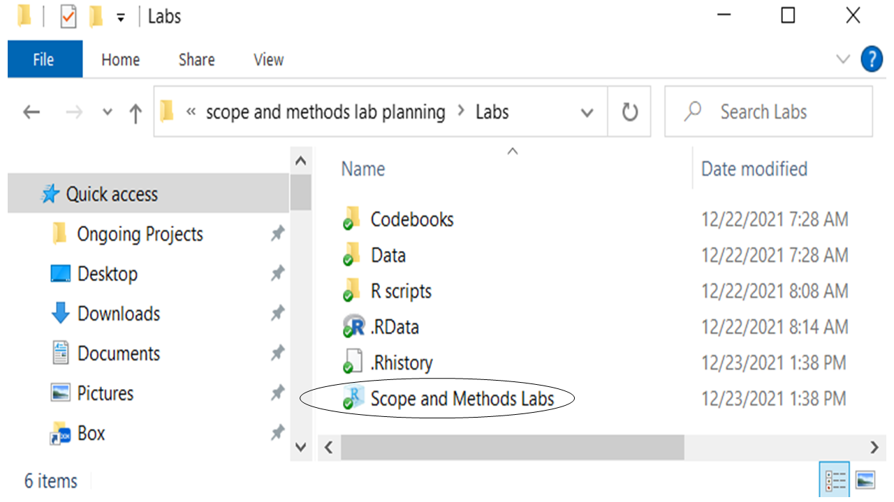
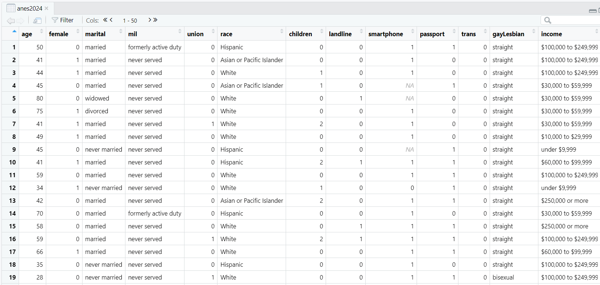

# Welcome to the tidyverse {#tidyverse}

## Installing packages {#install-tidyverse}

One of the nice things about R is that users can create their own libraries of commands. These can be extremely powerful and useful tools. There is an excellent set of tools that are in a library called the "tidyverse." To install the tidyverse on your local computer, first, make sure that your computer is attached to the internet. Second, enter this command into the Console of RStudio and press Enter:
```
install.packages("tidyverse")
```
Once you hit enter, you should see some action in your Console (what it says will depend on what version of R you are using). Some of it might be in red, but don't worry about it. Now you have installed the tidyverse! We will regularly work with the tools that this library makes possible for us. 

## Exploring dataframes {#exploring}
To begin exploring dataframes, open the project that you made in the last lab. There are two ways that you can do this:

1. You can open RStudio, go to File, open project, and navigate to the file called Scope and Methods labs.
2. You can navigate to the folders that you made last lab and double click the file called "Scope and Methods Labs," like the circled file below:

```{r open_project, echo = FALSE, out.width='60%'}

```

If you followed the instructions in section \@ref(first-script), you should see an object called anes2024 in your environment. To load the other two dataframes that you will need to use this workbook, copy and paste these two commands into your Console, one by one:
```
load("Data/states2025.Rda") 
```
```
load("Data/world2025.Rda") 
```
If those commands don't work, you should load anes2024 (if you haven't already), states2025, and world2025 using the instructions from section \@ref(wont-load). 

Those files are the dataframes that we will be doing most of our analysis on in this class. As I mentioned in the last chapter, a dataframe is essentially a group of vectors attached to one another, and is an extremely useful way of storing data for analysis. Here is a quick summary of those three dataframes:

- anes2024 is a snippet of the American National Election Survey, a survey that has been conducted at every election since 1948 by scholars based out of the University of Michigan and Stanford. This dataframe that I created only looks at the 2024 election. You can find more information about ANES at their website, [https://electionstudies.org/](https://electionstudies.org/)
-	states2025 is a dataframe with information about US States. It is based on data that I collected from a variety of sources. You can find information about the source of each variable in the file "States 2025 codebook.pdf", which is in the codebooks folder that you downloaded with the other class materials in section \@ref(add-files). If you'd like to suggest additional variables to go in this dataset, please <a href="https://www.michaelstrausz.com/contact">contact me.</a>
-	world2025 is a dataframe with information about most of the countries in the world. It is based on data that I collected from a variety of sources. You can find information about the source of each variable in the file "World 2025 codebook.pdf", which is in the codebooks folder that you downloaded with the other class materials in section \@ref(add-files). If you'd like to suggest additional variables to include, please <a href="https://www.michaelstrausz.com/contact">contact me.</a>

To begin, let’s take a look at the anes2024 dataset using the "View()" command (note that "View" is capitalized, unlike many R commands). Enter this command into the Console and then hit Enter:

```
View(anes2024)
```
When you hit enter, the following should come up on your screen:
```{r view, echo = FALSE, out.width='90%'}

```

This is a neat visualization of the ANES data. Each row represents one case. Since ANES is a survey, each case is a single individual who took the survey. Each column represents a variable: something that the survey designers wanted to measure about the people taking the survey. Look at row #1. That describes a person who is 50-years-old, married, formerly active duty in the military, not a union member, Hispanic, etc. If you want to see what all of the variables mean, you can look at the file ANES 2024 codebook, which you should have downloaded in section \@ref(add-files) as part of the "codebooks" folder.

Now let’s say that we want to know a bit more about the age variable. How old was the average person that took our survey? To answer, we need to learn two more R commands: the "\$" and the command "summary." The "\$" command helps us identify single columns within a dataframe. So, if we just want to see the age column, you can type this in the Console:

```{r, echo=FALSE, warning=FALSE, message=FALSE}
load("Data/anes2020.Rda")
load("Data/states2010.Rda")
load("Data/world.Rda")
load("Data/anes2024.Rda")
load("Data/states2025.Rda")
load("Data/world2025.Rda")

library(tidyverse)
options(dplyr.summarise.inform = FALSE)
```

```
anes2024$age
```
When you do this, you will see that R gives you the age of every single person who took the survey. Kind of interesting, but not all that useful. So, let’s try something else. Type summary(anes2024$age) into the Console, and you get these results:
```{r}
summary(anes2024$age)
```
This gives you a lot of useful information! You can see that the youngest age in the dataframe is 18 (likely because they were not surveying minors), and the oldest is 80.^[If you look in the codebook, you will see that the survey codes everyone 80 and over as 80.] You will also see that the median age is 54 and the mean is 53.15. And, you will see that there are 279 NAs. "NA" is what R reports when it does not have data in a particular variable. So, there are 279 cases for whom we don’t have data on their ages.

The "summary" command is very useful with numeric data, like age. However, what if you have a variable like "marital," which measures the marital status of individuals? The mean and median of this variable would not be meaningful, but we might want to know how many married, single, divorced, etc. people there are in our dataframe. To get this information, we can use the "table" command, like this:
```
table(anes2024$marital)
```
That command generates this output:
```{r, echo=FALSE}
table(anes2024$marital)
```
In other words, our dataframe has 771 divorced people, 2745 married people, 1242 never married people, etc. Useful stuff!

## Organizing your scripts {#org-script}
As you use R you will generate a lot of script files, and if you are not careful you might find yourself forgetting what some of your scripts are for. This is where the # characters can be really helpful. You can leave notes to yourself.  

This is a nice way to add headers to R script files:
```
####################################
# Your name
# Project, Purpose of R file
# Date started : Date last modified
####################################
```
Then, when you open a script file, you can see right away when you made it and what it is for. You can customize this header as is helpful to you.

## Welcome to the tidyverse
Perhaps the code package that has had the biggest impact on how people do R in the last few years had been the "tidyverse".  To take advantage of this great library which you installed in section \@ref(install-tidyverse), you first have to activate it. You will have to do this step every time that you open R, so I often put it at the top of my script files.

To follow along, open a new script file and save it in your scripts folder as "chapter 2 practice." Copy and paste this onto the page:
```
####################################
# Your name
# 20093 Chapter 2, Practice exercises
# Date started : Date last modified
####################################

#libraries------------------------------------------
library(tidyverse)
```
Now select all the text on this page, run it, and then save it. You should see something like this in your Console:
```
── Attaching core tidyverse packages ────────────────── tidyverse 2.0.0 ──
✔ dplyr     1.1.4     ✔ readr     2.1.5
✔ forcats   1.0.0     ✔ stringr   1.5.1
✔ ggplot2   3.5.0     ✔ tibble    3.2.1
✔ lubridate 1.9.3     ✔ tidyr     1.3.1
✔ purrr     1.0.2     
── Conflicts ──────────────────────────────────── tidyverse_conflicts() ──
✖ dplyr::filter() masks stats::filter()
✖ dplyr::lag()    masks stats::lag()
ℹ Use the conflicted package to force all conflicts to become errors
```
Don’t worry about the warning messages. The list of packages are the libraries of commands that come with the tidyverse library. The two that we will be using the most are **ggplot2**, which is terrific for graphing, and **dplyr**, which is great for managing data. Since you have installed the tidyverse, you will not have to install those packages separately – you already have them installed.

### Introducing the 'pipe' in tidyverse
Now that we have access to the tidyverse, we will use a few of the commands that are available to us through the dplyr package to get a better look at some of our data. Before we can do that, however, we need to learn about the somewhat strange feature of dplyr, the "pipe." The pipe is this set of characters:
```
%>%
```
You can always type those three characters to build a pipe, but you can also type Ctrl-Shift-M on a Windows machine or Cmd + Shift + M on a Mac. I am going to repeat this, in bold, because it is an *extremely* useful keyboard shortcut. **You can always type those three characters to build a pipe, but you can also type Ctrl-Shift-M on a Windows machine or Cmd + Shift + M on a Mac.**

The pipe means "and then." Let’s try an example, using the glimpse() command that is available in the tidyverse.

Try entering this command into your script file:
```
anes2024 %>% 
  glimpse() #taking a different kind of look at our dataframe
```
Highlight that text and run that command. You should see a lot of output in the Console. If you scroll up a bit in the Console, you should see something like this (this is just the first 12 variables in this dataframe; you will have access to more on your screen):
```{r, echo=FALSE}
anes2024 %>% 
  dplyr::select(age:gayLesbian) %>% 
  glimpse()
```
This is giving us information about the dataframe anes2024. At the top, you can see that the dataframe has 5,521 rows. Since this is a survey, and each row represents one person that was surveyed, that tells us that the anes2024 dataframe represents a survey of 5,521 people. On the output above, you can see that the dataframe has 12 columns (because I told R to only display the first 12.) If you ran the command, you should see that the full dataframe has 83 columns, which means that the dataframe measures 83 variables. The glimpse() command in the tidyverse gives us a bit of information about each of these variables. On the left of the output you can see all of the variable names (age, marital, etc.). And then just to the right of that you can see the way that R is classifying those variables (\<int>, \<chr>, \<ord>, etc.). We will learn a bit more about those classifications in future chapters. To the right of those classifications you can see the first set of values of each variable.

### select() in tidyverse
Many dataframes are quite large, and you might find yourselves wanting to focus on a few variables at a time. The command select() can be helpful for this. Let’s say that you want to focus in on how many guns people have in their homes and their feelings about the NRA. In that case, you would want to select the variables "ft_nra" and "guns", which you can do like this:
```
anes2024 %>% 
  select(guns, ft_nra) #focusing in on a few variables
```
### A warning about the select() command
Unfortunately, some of the packages that we will be installing in future labs also use the command select. If you ever run "select" and have more than one of these packages installed, R will give an error. When you get that error, you can add "dplyr::" before select(), to tell R to look at the select() in the dplyr library (which comes with the tidyverse). Here is how the above command would look with that modification:  
```
anes2024 %>% 
  dplyr::select(guns, ft_nra) #focusing in on a few variables
```
If you run either of these commands (with or without the dplyr::), and scroll up a bit in the Console, you will see output that begins like this:
```{r, echo=FALSE}
anes2024 %>% 
  dplyr::select(guns, ft_nra) %>%  #focusing in on a few variables
  head(., 10)
```
This is a way of displaying dataframes that is unique to the tidyverse called a "tibble." Each row represents a case, and each column represents a variable (except for the leftmost column, which is just the case number. Looking at case #1, you can see that that person owns 3 guns, and rates the NRA 50 out of 100. Case #2 also rates the NRA 50, but owns no guns. 

Notice that the dataframe that had been so large before, with 68 columns, now only has 2 columns. If you want to use that glimpse() command from above to just get summary information about each of our variables, you can use a second pipe (%>%) like this:
```
anes2024 %>% 
  select(guns, ft_nra) #focusing in on a few variables%>%
  glimpse() #taking a different kind of look at our dataframe
```
### arrange() in tidyverse
What if we want to see what the people in our sample with the most and fewest guns thought about the NRA? To do that, we can arrange our dataframe from smallest to largest or from largest to smallest on any of our variables. Or, with variables that include text, we can sort according to alphabetic or reverse alphabetic order. We can use the arrange() command to do that:

```
anes2024 %>% 
  select(guns, ft_nra) %>% #focusing in on a few variables
  arrange(guns) #sorting this variable from smallest to largest
```
When we run the above command, the Console shows us the feeling about the NRA by the people with the fewest guns first, and then on to the people with more guns. But what if we want to see the largest values on the "guns" variable first? To do that, we need to use desc() to modify arrange() like this:
```
anes2024 %>% 
  select(guns, ft_nra) %>% #focusing in on a few variables
  arrange(desc(guns)) #sorting this variable from largest to smallest
```
### glimpse() in tidyverse
Finally, combining all of the commands that we learned today, we can use glimpse() to see information about each of our variables in this simplified version of our dataframe. To do that, we will need a third pipe:
```
anes2024 %>% 
  select(guns, ft_nra) %>% #focusing in on a few variables
  arrange(desc(guns)) %>% #sorting this variable from largest to smallest
  glimpse() #taking a different kind of look at our dataframe
```
## Review of this chapter's commands
```{r, echo=FALSE,warning=FALSE}
r1<-c("install.packages(\"\")",
      "To install new packages, or libraries of R commands. You have to do this only once on your computer per library when your computer is connected to the internet so that it will download the relevant library.", "Base R")
r2<-c("View()","Displays a dataframe as a spreadsheet. Notice that the word \"View\" is capitalized.", "Base R")
r3<-c("summary()", "Displays summary information (like mean and median) about a numeric variable. To call a variable, use a dollar sign. So, like this: \"summary(dataframe\\$variable)\"","Base R")
r4<-c("table()","Displays the number of times each value of a variable appears in a dataframe. Most useful for variables with a relatively small number of possible values. To call a variable, use a dollar sign. So, like this: \"table(dataframe\\$variable)\"","Base R")
r5<-c("library()","To ask R to load a library into your session. You must use this command every time that you open R if you want it to use a particular library.","Base R")
r6<-c("%>%","The \"pipe.\" Useful with manipulating data in the tidyverse.","dplry (tidyverse)") 
r7<-c("glimpse()","Display general information about a dataset, including looking at the variable names, types, and a few values in rows. Often preceded by a pipe.","dplyr (tidyverse)")
r8<-c("select()","Allows you to select a few variables to focus on. Often preceded by a pipe. You can use the variable names without dollar signs.","dplyr (tidyverse)")
r9<-c("arrange(desc())","Sorts a dataframe from largest to smallest values of a particular variable (or in reverse-alphabetical order). Often preceded by a pipe. You can use the variable names without dollar signs.","dplyr (tidyverse)")
df<-rbind(r1,r2,r3,r4,r5, r6,r7,r8,r9)
colnames(df)<-c("Command","Purpose","Library")
df<-as.data.frame(df)
rownames(df)<-NULL
knitr::kable(df, row.names=NA, align = c("llll"))
rm(r1,r2,r3,r4,r5,r6,r7,r8,r9,df)
```